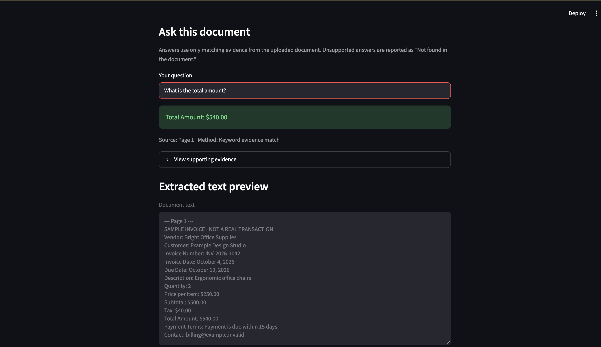

# DocuMind AI

A privacy-first document assistant for freelancers and small businesses.

DocuMind AI reads PDF invoices, validates them for safe processing, extracts verified fields with page-level sources, answers supported questions, and creates downloadable CSV reports.

> **Current implementation:** This version uses deterministic, evidence-based document processing. It does not yet use a large language model or external AI API.
## Application preview



## Features

- Upload and inspect PDF documents
- Enforce a 10 MB upload limit
- Validate PDF file signatures
- Reject invalid or password-protected PDFs
- Enforce a 50-page processing limit
- Reject scanned documents when readable text cannot be verified
- Process uploaded files temporarily in memory
- Extract labeled invoice fields
- Report missing information as `Not found`
- Show the source page and extraction method
- Answer questions using matching document evidence
- Refuse unsupported questions instead of guessing
- Display supporting evidence for answers
- Download verified extraction results as a CSV report
- Protect CSV exports from spreadsheet-formula injection
- Limit the extracted-text preview
- Include only synthetic sample documents

## Extracted invoice fields

- Vendor
- Customer
- Invoice Number
- Invoice Date
- Due Date
- Subtotal
- Tax
- Total Amount
- Payment Terms

## Safety guardrails

DocuMind AI is designed to return only information supported by the uploaded document.

- No unsupported or fabricated answers
- No legal, medical, tax, or financial advice
- Missing information is clearly reported
- Answers include page-level sources
- Uploaded documents are not permanently saved
- Unsafe or unsupported PDF files are rejected
- Exported reports contain only approved fields
- Spreadsheet-formula prefixes are neutralized before export

## Technology

- Python
- Streamlit
- PyMuPDF
- Python `unittest`
- Git and GitHub

## Project structure

```text
documind-ai/
├── app.py
├── document_search.py
├── invoice_extraction.py
├── pdf_inspection.py
├── report_export.py
├── create_sample_pdf.py
├── requirements.txt
├── sample_documents/
└── tests/
```

## Run locally

Create and activate a virtual environment:

```bash
python3 -m venv .venv
source .venv/bin/activate
```

Install the required packages:

```bash
python -m pip install -r requirements.txt
```

Start the application:

```bash
python -m streamlit run app.py
```

Open the local address displayed in the terminal, normally:

```text
http://localhost:8501
```

## Run the tests

```bash
python -m unittest discover -s tests -v
```

The current test suite contains **17 tests** covering:

- Invoice field extraction
- Safe PDF inspection
- Evidence-based document search
- Safe CSV report generation

## Example workflow

1. Upload the synthetic sample invoice.
2. Review the extracted fields and their page sources.
3. Ask a supported question such as `What is the total amount?`
4. Review the matching evidence.
5. Download the verified CSV report.
6. Ask an unsupported question and confirm that the application responds with `Not found in the document.`

## Privacy

Uploaded documents are processed temporarily in memory. This repository includes only synthetic sample data and should not be tested with private or sensitive documents during development.

## Roadmap

- Add retrieval-augmented generation with an approved AI model
- Add prompt-injection defenses for document content
- Support additional document types
- Add stronger evaluation and retrieval-quality tests
- Deploy a public demonstration using synthetic data only